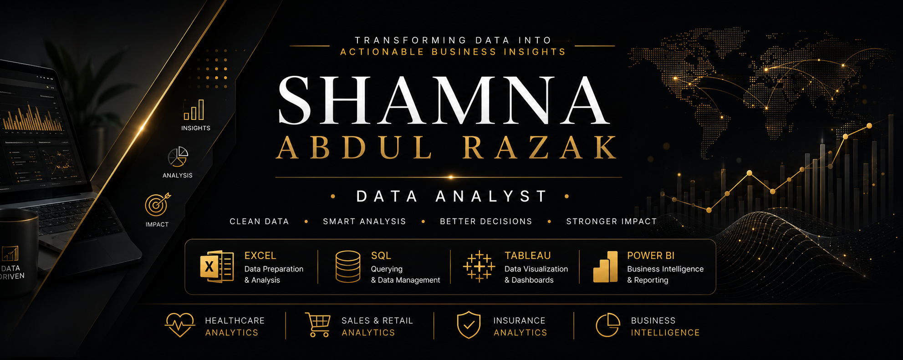

  

<h3 align="center">Data Analyst | Business Intelligence Enthusiast | Dashboard Developer</h3>

Transforming raw data into meaningful insights through interactive dashboards, business intelligence, and data storytelling.

---

## About Me

I am an aspiring **Data Analyst** passionate about helping organizations make better business decisions through data.

My expertise lies in transforming raw datasets into interactive dashboards and actionable insights using modern Business Intelligence tools.

I enjoy solving business problems across different domains including **Healthcare**, **Retail**, and **Insurance**, while continuously learning new technologies and analytical techniques.

---

## Technical Skills

### Data Visualization & BI

### Programming & Database

### Core Competencies

- Data Cleaning
- Data Analysis
- Dashboard Development
- Business Intelligence
- Data Visualization
- KPI Reporting
- Pivot Tables
- Pivot Charts
- DAX
- Data Storytelling
- Business Analytics

---

## Featured Projects

### Healthcare Performance Analytics

**Tool:** Tableau

Interactive healthcare dashboard analyzing patient satisfaction, operational efficiency, waiting time, consultation performance, and department-level insights across multiple hospital branches.

🔗 **Repository**

https://github.com/Shamnarazak/Healthcare-Patient-Satisfaction-Analysis

---

### Luxe Perfume Analytics

**Tool:** Microsoft Power BI

Luxury retail analytics dashboard exploring revenue, profitability, customer demographics, brand performance, and sales trends through interactive business intelligence reporting.

🔗 **Repository**

https://github.com/Shamnarazak/Perfume-Sales-Analysis

---

### Insurance Claims & Risk Intelligence

**Tool:** Microsoft Excel

Interactive insurance dashboard monitoring claims, premium revenue, fraud indicators, policy performance, regional risk exposure, and operational efficiency.

🔗 **Repository**

https://github.com/Shamnarazak/Insurance-Claim-Analysis

---

## Certifications

- Google Data Analytics Professional Certificate
- KHDA Certified Data Analytics Program

*(More certifications coming soon.)*

---

## Domains Explored

🏥 Healthcare Analytics

🌸 Retail & Sales Analytics

🛡 Insurance Analytics

📊 Business Intelligence

---

## GitHub Statistics

---

## GitHub Streak

---

## Connect With Me

---

## My Goal

My goal is to build analytical solutions that enable organizations to make smarter, data-driven decisions by transforming complex datasets into intuitive dashboards and meaningful business insights.

---

⭐ Thanks for visiting my profile!

